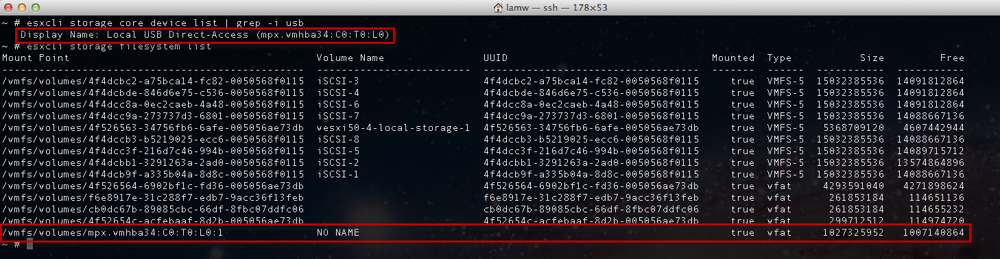

# USB-Storage-Access-in-ESXi
https://www.virtuallyghetto.com/2012/03/how-to-access-usb-storage-in-esxi-shell.html

To access a USB storage key directly on a ESXi host (not pass-through to VMs).

Disclaimer: This is mainly for educational and testing purposes as this is not officially supported by VMware. Please use at your own risk.

only USB storage devices formatted with FAT16 can be accessed in the ESXi shell.

Step 1 - Login to ESXi Shell via SSH and disable the USB Arbitrator service (this is automatically enabled by default to allow pass-through of USB devices to your VMs) using the following command: 
```
/etc/init.d/usbarbitrator stop
```
<p align="center">
  
</p>

Step 2 - Plug-in your USB device to your ESXi host and you can verify by using the two ESXCLI commands: verifying the storage device using the command: esxcli storage core device list | grep -i usb or viewing the mounted filesystems using the command: 
```
esxcli storage filesystem list
```
<p align="center">
  
</p>

Step 3 - Lastly, after you verify the USB device can be seen by the ESXi host, you can of course browse and access your USB device by looking under
```
ls /vmfs/volumes/
```
<p align="center">
  
</p>

Te re-enable pass-through of USB devices to your VMs, you just need to start the usbarbitrator service.
```
/etc/init.d/usbarbitrator start
```
